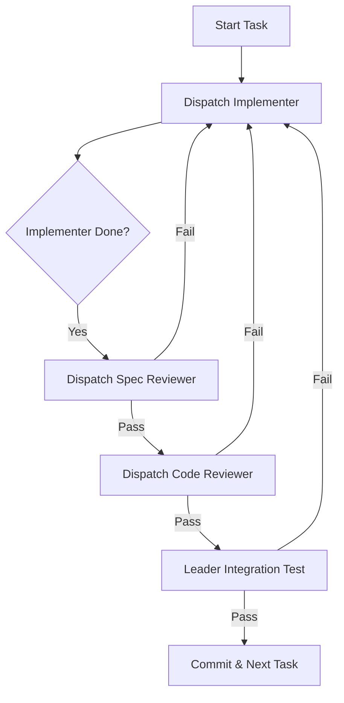

# Subagent-Driven Development (SDD)

## Overview

The most reliable way to execute complex work. Do not do the work yourself. Manage agents who do the work.

**Role:** You are the Project Manager / Lead Engineer.
**Team:** Worker Agents (Implementers) and QA Agents (Reviewers).
**Goal:** High-quality, verified code through adversarial review loops.

## The Loop

For EACH task in your plan:

### 1. Dispatch Implementer

Start a subagent to write the code.
**Prompt Template:** `resources/implementer-prompt.md`

- Give them the specific task from the plan.
- Give them TDD instructions.
- Wait for them to report "Done".

### 2. Dispatch Spec Reviewer (Adversarial)

Start a DIFFERENT subagent to check requirements.
**Prompt Template:** `resources/spec-reviewer-prompt.md`

- **Instruction:** "Check if Implementer actually built Task N properties. Verify by reading code. Do not trust their report."
- **If Fails:** Send Implementer back to work. "Spec Review failed: [reasons]. Fix it."

### 3. Dispatch Code Reviewer (Quality)

Start a THIRD subagent (or same as Spec Reviewer if efficient) to check quality.
**Prompt Template:** `resources/code-quality-reviewer-prompt.md`

- **Instruction:** "Check for code quality, safety, style, tests."
- **If Fails:** Send Implementer back to work. "Code Review failed: [reasons]. Fix it."

### 4. Integration & Merge

Once both reviews pass:
- You (Leader) run the full test suite.
- If passes: Commit and Mark Task Done.

## Decision Logic

## Why This Works

- **Context Isolation:** Implementer only cares about Task N.
- **Adversarial Review:** Reviewer's job is to find faults, not to be nice.
- **Double Check:** You verify everything at the end.

## Integration

**Preceded by:** `writing-plans` (Need a plan to drive this).
**Uses:** `requesting-code-review` (for the Reviewer steps).
